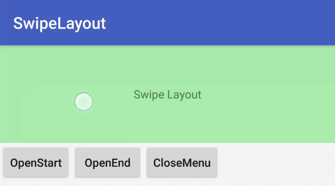
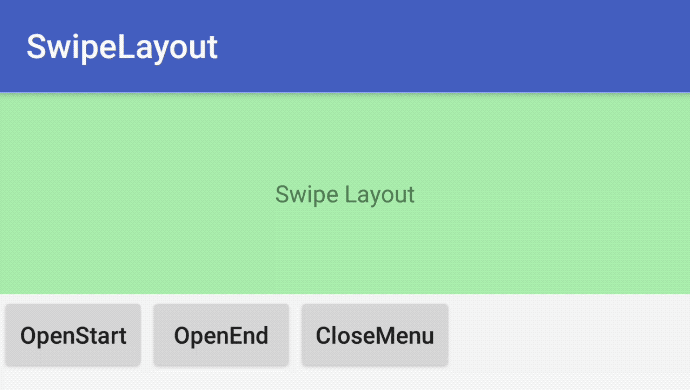

# SwipeLayout

[](https://maven-badges.herokuapp.com/maven-central/com.picoscott/swipelayout)

# Installation

# Usage

The first one is SwipeLayout that extends the FrameLayout. You can specify the attributes from a layout XML like:

```
<com.scott.swipe.SwipeLayout xmlns:android="http://schemas.android.com/apk/res/android"
    xmlns:app="http://schemas.android.com/apk/res-auto"
    android:layout_width="match_parent"
    android:layout_height="150dp"
    app:swipeOrientation="horizontal"
    app:swipeStatusPosition="0.5">

    <FrameLayout
        android:layout_width="200dp"
        android:layout_height="100dp"
        android:background="#aaa"
        app:layout_itemType="start_item"/>
        
    <FrameLayout
        android:id="@+id/end_item"
        android:layout_width="200dp"
        android:layout_height="50dp"
        android:layout_gravity="end"
        android:background="#faf"
        app:layout_itemType="end_item"/>

    <FrameLayout
        android:id="@+id/swipe_item"
        android:layout_width="match_parent"
        android:layout_height="match_parent"
        android:background="#afa"
        app:layout_itemType="swipe_item"/>

</com.scott.swipe.SwipeLayout>
```




## Attribute for the SwipeLayout

* __swipeOrientation__
    * SwipeOrientation control swipe direction. Possible values are:
        * horizontal (default)
        * vertical

* __swipeHandler__
    * SwipeHandler is full name of class that is instance of [EndSwipeHandler](./swipe/src/main/java/com/scott/swipe/EndSwipeHandler.java). For example, when finger lift from screen, [SwipeSnapHandler](./swipe/src/main/java/com/scott/swipe/SwipeSnapHandler.java) is sticky to edge.

* __swipeStatusPosition__
    * The attribute is create to swipeHandler. 
        * float
        * dimen

## Attributes for the children of a SwipeLayout

* __layout_itemType__
    * These indicate the type of child view
        * none (default)
        * swipe_view
        * start_menu
        * end_menu

# License

Please see [LICENSE](./LICENSE.md)
